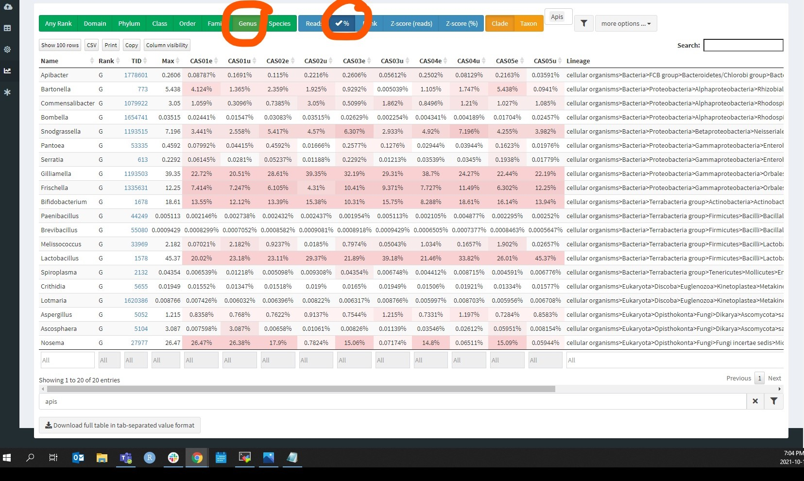
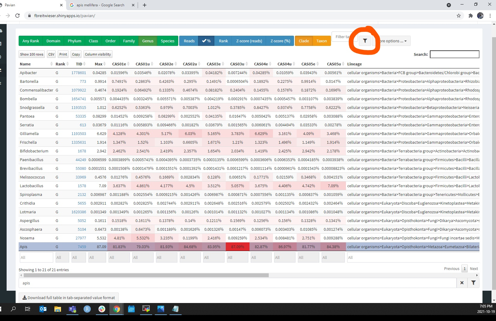

# Pavian

## In MobaXterm:
* Open an SFTP session
* Navigate to the directory where you ran the workflow, using the absolute path
   * eg, /isilon/lacombe-rdc/users/tranlan/cas_2020
   * Navigate to the file with a name similar to cas_kraken2
* Download the report.txt files

## Navigate to the [Pavian site](https://fbreitwieser.shinyapps.io/pavian/)
* On the “Data Selection” page:
   * Upload all the report.txt files
      * NB: the Pavian site times out after relatively short amount of time if left inactive, and when it does you have to re-upload the desired files
   * At the moment there have been some problems encountered when trying to run Pavian on R, but in theory it should be possible
* To access the resources needed to generated the NMDS and bar graphs, go to the “Comparison” page:
   * Change the rank preference from “Any Rank” to “Species”
   * Change “Reads” to “%” 
      * Make sure you unselect “Reads”, rather than just add percentages to the number of reads
   * Change the rank preference from “Any Rank” to “Species”
      *  
      * 
   * Remove Apis mellifera and Varroa reads from the data by selecting their respective rows and then clicking the golf tee symbol on the top right
    * 
    * Download a .tsv version of this data using the button at the bottom of the page
 * If you wish to see a Sankey visualization of all species present in each sample, go to the “Sample” page
    * NB: viruses have been filtered out by the snakemake workflow

